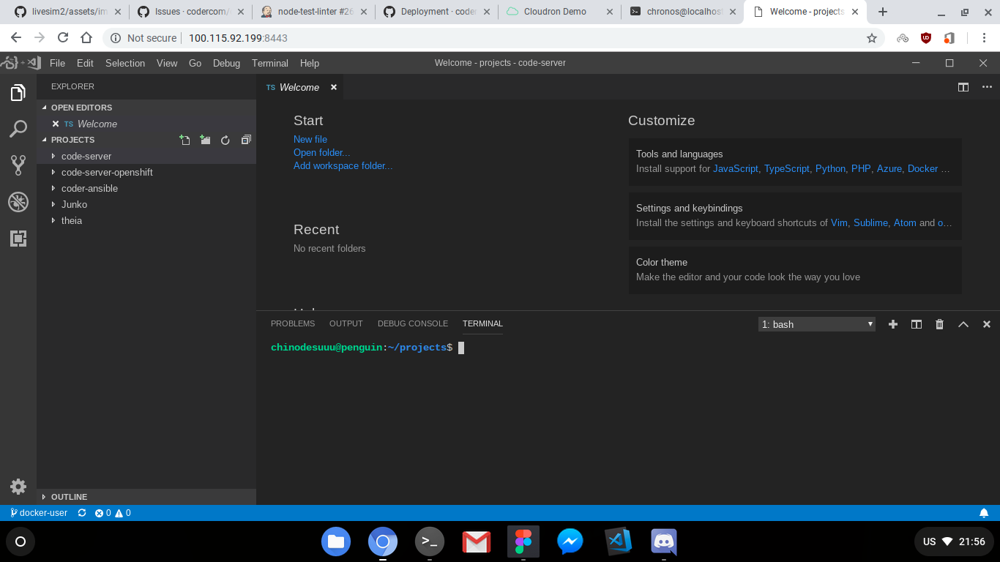

# Installng code-server in your ChromiumOS/ChromeOS/CloudReady machine

This guide will show you how to install code-server into your CrOS machine.

Before everything else, you are required to turn on developer mode for your machine, but for ChromiumOS and CloudReady users (Home Edition), this is done for you.

## Using Crostini

One of the easier ways to run code-server is via [Crostini](https://www.aboutchromebooks.com/tag/project-crostini/), the Linux apps support feature in CrOS. Make sure you have enough RAM, HDD space and your CPU has VT-x/ AMD-V support. If your chromebook has this, then you are qualified to use Crostini.

If you are running R69, you might want to enable this on [Chrome Flags](chrome://flags/#enable-experimental-crostini-ui). If you run R72, however, this is already enabled for you.

After checking your prerequisites, follow the steps in the [the self-host install guide](index.md) on installing code-server. Once done, make sure code-server works by running it.

After confirming it runs, head over to `crosh`, the native terminal for your Chromebook. Reiterating, you must have developer mode enabled to be able to enter `crosh`.

Once in `crosh`, type `vsh termina`. It should drop you to the Termina's shell.

```bash
Loading extra module: /usr/share/crosh/dev.d/50-crosh.sh
Welcome to crosh, the Chrome OS developer shell.

If you got here by mistake, don't panic!  Just close this tab and carry on.

Type 'help' for a list of commands.

If you want to customize the look/behavior, you can use the options page.
Load it by using the Ctrl+Shift+P keyboard shortcut.

crosh> vsh termina
(termina) chronos@localhost ~ $
```
Now, while in termina, run `lxc list`. It should render you this output.

```bash
(termina) chronos@localhost ~ $ lxc list
+---------+---------+-----------------------+------+------------+-----------+
|  NAME   |  STATE  |         IPV4          | IPV6 |    TYPE    | SNAPSHOTS |
+---------+---------+-----------------------+------+------------+-----------+
| penguin | RUNNING | 100.115.92.199 (eth0) |      | PERSISTENT | 0         |
+---------+---------+-----------------------+------+------------+-----------+
(termina) chronos@localhost ~ $ 
```

Crostini has IPv4 outbound networking so that means, it is bound to `eth0` in this case. Take note of the IP, then simply go to `<penguin IP>:8443` to access code-server. Now you should be greeted with this screen. If you did, congratulations, you have installed code-server in your Chromebook!



**Note: alternatively, you can use `penguin.linux.test` to access code-server without going to developer mode.**

## Using Crouton

[Crouton](https://github.com/dnschneid/crouton) is one of the old ways to get a running full Linux via `chroot` on a Chromebook. Like so, enable developer mode, and go to `crosh`. This time, run `shell`, which should drop you to `bash`.

Make sure you downloaded `crouton`, if so, go ahead and run it under `~/Downloads`. After installing your chroot container via crouton, go ahead and enter `enter-chroot` to enter your container.

Follow the instructions set in [the self-host install guide](index.md) to install code-server. After that is done, run `code-server` and verify it works by going to `localhost:8443`.

> At this point in writing, `localhost` seems to work in this method. However, the author is not sure if it applies still to newer Chromebooks.
