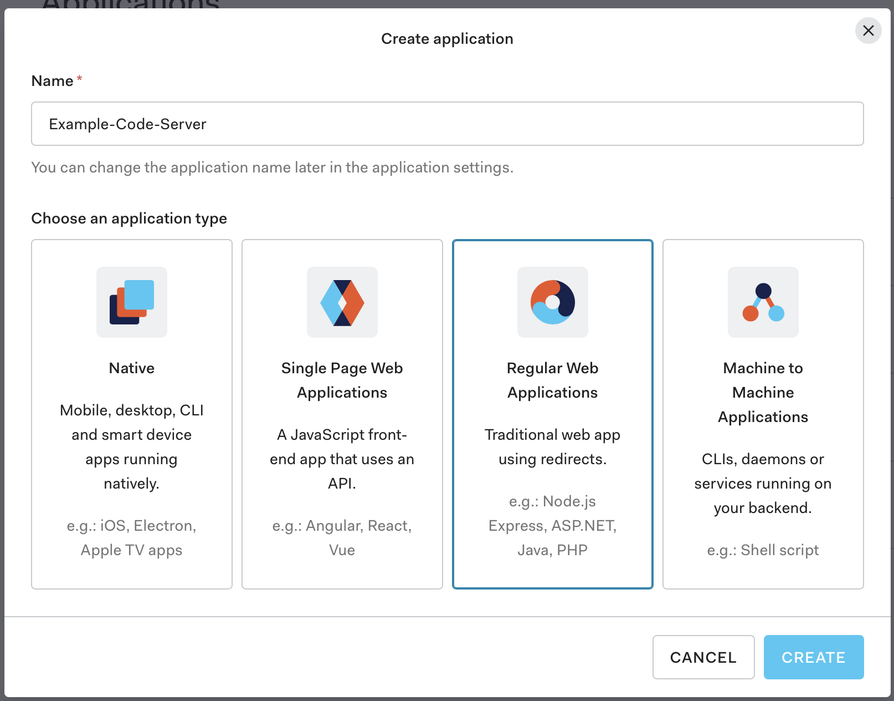
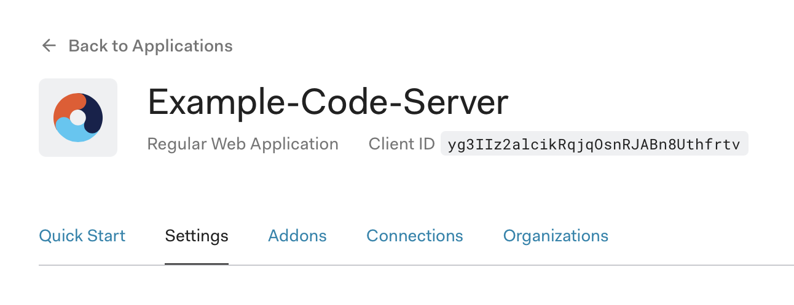
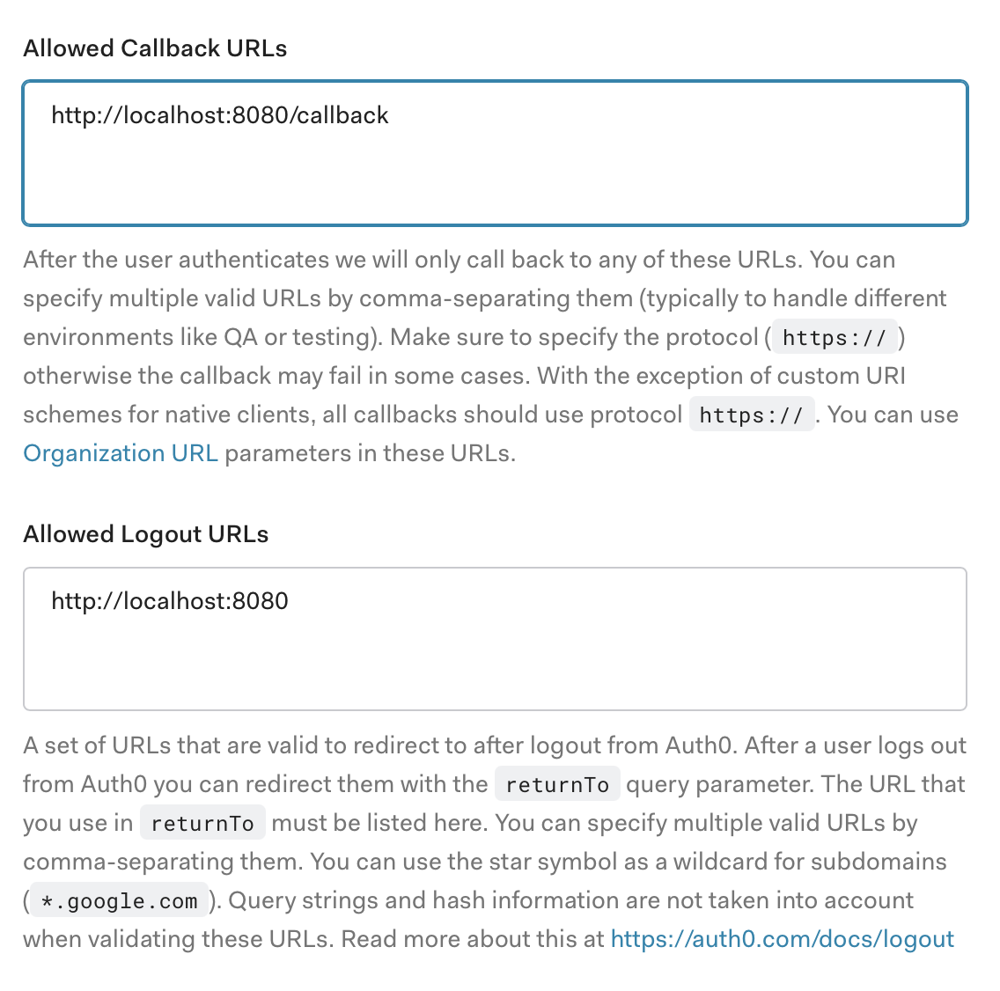
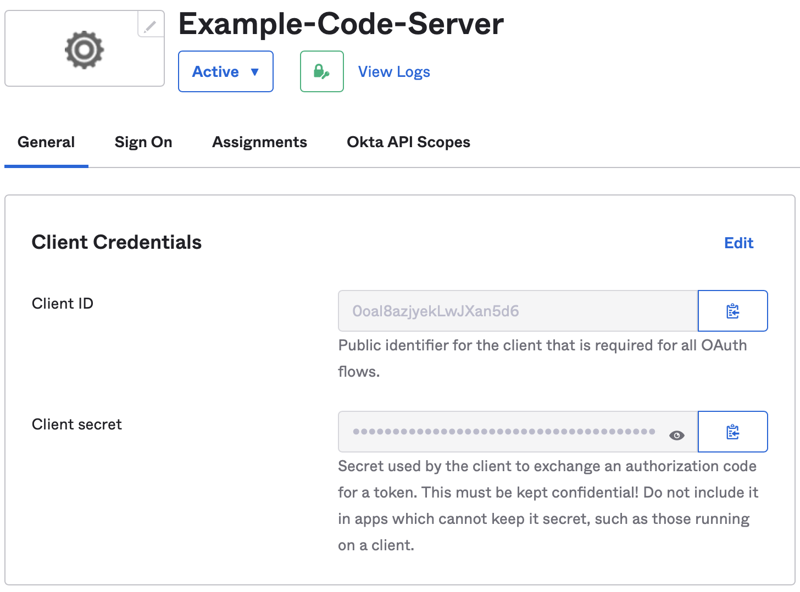
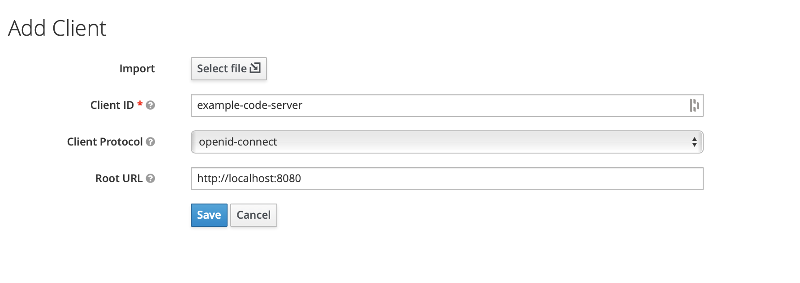
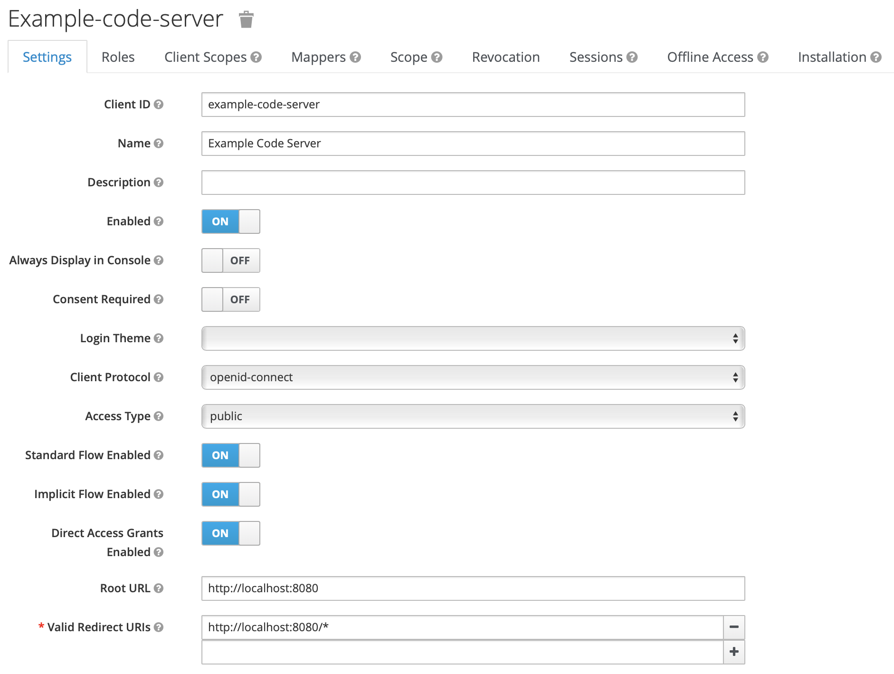

# Configuring OpenID Authentication

The purpose of this guide is to demonstrate the process of configuring an OpenID Application as an authentication and authorization source for Code-Server.

More information reguarding how OpenID Connect works can be found here:
- https://openid.net/connect/faq/
- https://auth0.com/docs/protocols/openid-connect-protocol
- https://developer.okta.com/blog/2019/10/21/illustrated-guide-to-oauth-and-oidc

## Prerequisites
- Either Keycloak has been deployed or an existing Auth0/Okta account exist.
    - Auth0 Signup: https://auth0.com/signup
    - Okta Signup: https://developer.okta.com/signup/
    - Getting started with Keycloak: https://www.keycloak.org/docs/latest/getting_started/
- A value needs generated for `openid-secret`. This value will be used to encrypt the OpenID Connect session token.
    - MacOS/Linux: `openssl rand -base64 25`
    - Windows: https://activedirectoryfaq.com/2017/08/creating-individual-random-passwords/

## Auth0 OpenID Connect Application Setup

### Creating The Application
1. Navigate to the Application management section of your Auth0 dashboard at `https://manage.auth0.com/dashboard/us/{{auth0_account_name}}/applications`
2. Click the ***Create Application*** button in the top right of the page.
3. Either provide a name for this application or use the default, then select ***Regular Web Application*** as the application type and click the blue ***Create*** button.
{:height="50%" width="50%"}.

### Gather The Client ID
1. Make note of the `Client ID` value. This value will be used in the Code-Server `openid-client-id` configuration variable.
{:height="50%" width="50%"}.

### Update the application URLs
1. Update the ***Allowed Callback URL*** and ***Allowed Logout URLs*** fields so that they point to the correct code-server endpoint.
{:height="50%" width="50%"}.

### Example Auth0 Code-Server Configuration
---
**NOTE:** The `openid-issuer-base-url` should be set to the value of the ***Domain*** field of the Okta application.

---
``` yml
bind-addr: 127.0.0.1:8080
cert: false

auth: openid
openid-issuer-base-url: "https://cdr.auth0.com"
openid-client-id: "yg3IIz2alcikRqjqOsnRJABn8Uthfrtv"
openid-base-url: "http://localhost:8080"
openid-secret: "{prerequisites_openid-secret_value}"
```

## Okta OpenID Connect Application Setup

### Creating The Application
1. Navigate to the ***Add Application*** page of your Okta dashboard at `https://{{okta_account_name}}-admin.okta.com/admin/apps/add-app`
2. Click the ***Create New App*** button located in the upper right of the page.
3. Set the ***Platform*** to ***Web*** and ***Sign on method*** to ***OpenID Connect***. Then click ***Create***
{:height="50%" width="50%"}.

### Update the application Name and URLs
1. Update the ***Application name*** field with the desired name for this application.
2. Update the ***Login redirect URIs*** and ***Logout redirect URIs (Optional)*** fields so that they point to the correct code-server endpoint then click ***Save***
{:height="50%" width="50%"}.

### Gather The Client ID
1. Make note of the `Client ID` value. This value will be used in the Code-Server `openid-client-id` configuration variable.
{:height="50%" width="50%"}.

### Example Code-Server Configuration
---
**NOTE:** The `openid-issuer-base-url` should be set to the value of the ***Okta domain*** field of the Okta application.

---
``` yml
bind-addr: 127.0.0.1:8080
cert: false

auth: openid
openid-issuer-base-url: "https://cdr.okta.com"
openid-client-id: "0oal8azjyekLwJXan5d6"
openid-base-url: "http://localhost:8080"
openid-secret: "{prerequisites_openid-secret_value}"
```

## Keycloak OpenID Connect Client Setup

### Creating The Client
1. Once logged into the Keycloak instance, navigate to the ***Clients*** page by clicking the ***Clients*** link in the navigation menu on the left side of the page.
2. Begin the client creation process by clicking the ***Create*** button located in the top right corner of the clint list.
3. Fill out the client creation fields then click ***Save***
    - ***Client ID***: This is the value that will later be populated in `openid-client-id`. This value is entirely up the the user or process creating the client.
    - ***Client Protocol***: This value should be set to ***openid-connect***
    - ***Root URL***: This field should be populated with the Code-Server base url.
{:height="50%" width="50%"}.

### Update The Client Name
1. Once the ***Save*** button in the ***Add Client*** window has been clicked, the client will be created and the page will be redirected to the client settings view. From inside that view proceed to name the newly create client by populating the ***Name*** field. Then scroll to the bottom of the page and click ***Save***.
{:height="50%" width="50%"}.

### Example Code-Server Configuration
---
**NOTE:** The `openid-issuer-base-url` will depend on the Keycloak realm. In the example below the realm is called `master`. 

**NOTE:** The `openid-client-id` value should be set to the value given to the ***Client ID*** when the client was first created.

---
``` yml
bind-addr: 127.0.0.1:8080
cert: false

auth: openid
openid-issuer-base-url: "https://keycloak.local/auth/realms/master/.well-known/openid-configuration"
openid-client-id: "example-code-server"
openid-base-url: "http://localhost:8080"
openid-secret: "{prerequisites_openid-secret_value}"
```